# 🤖 SQLite Employee Database AI Agent

A powerful, intelligent natural language query interface for SQLite databases. Ask questions in plain English and get structured results instantly. Built with LangChain, Flask, and Google's Gemini API.

## ✨ Features

- 🗣️ **Natural Language Queries** - Ask questions in plain English, no SQL knowledge needed
- 🧠 **Intelligent Field Selection** - Agent automatically includes relevant columns based on query context
- 📊 **Rich Data Visualization** - Results displayed in beautifully formatted markdown tables
- 🎨 **Responsive UI** - Wide, modern interface optimized for desktop viewing
- ⚡ **Real-time Processing** - Fast query execution with streaming output
- 🔐 **Secure API Key Management** - Configure Google API key through web interface
- 📱 **Mobile Responsive** - Works on various screen sizes
- 🔍 **Comprehensive Logging** - Debug-level logging for monitoring and troubleshooting

## 🎯 Use Cases

```
"Show me employees in Engineering with Python skills"
→ Returns: first_name | last_name | skill | proficiency | department_name

"Engineers hired in last 2 years"
→ Returns: first_name | last_name | hire_date | department_name

"What departments have the most employees?"
→ Returns: department_name | employee_count | average_salary
```

## 💼 Real-World Scenarios

### HR & Recruitment
- **Find qualified candidates**: "Show me all employees with Machine Learning and advanced Python skills"
- **Identify retention risks**: "Who are the most senior employees in each department?"
- **Plan hiring**: "How many junior developers do we have compared to seniors?"
- **Salary analysis**: "Show me all VPs and their salary ranges"

### Team Management  
- **Build project teams**: "Find engineers with both Python and DevOps expertise hired in last 3 years"
- **Skill gaps analysis**: "Which departments lack JavaScript developers?"
- **Resource allocation**: "List all employees in Sales with Project Management skills"
- **Org structure**: "Show me all managers in Engineering and their direct reports"

### Business Intelligence
- **Departmental insights**: "Compare average salary and headcount across all departments"
- **Skill inventory**: "What are the top 5 most common skills in Engineering?"
- **Team composition**: "Show me the organizational structure - who reports to whom"
- **Payroll analysis**: "What's the total salary spend by department and hierarchy level?"
- **Career paths**: "Show me the manager hierarchy from CEO down to individual contributors in Sales"

## 📸 Screenshots

### Main Interface


### Query Results


### Advanced Queries


## 🏗️ Architecture

```mermaid
graph LR
    A["👤 User"] -->|"Query"| B["🎨 Web UI"]
    B -->|"POST /api/query"| C["🔧 Flask"]
    C -->|"Create Agent"| D["🧠 LangChain"]
    D -->|"Send Query"| E["🤖 Gemini LLM"]
    E -->|"Generate SQL"| F["💾 SQLite"]
    F -->|"Results"| E
    E -->|"Format Table"| D
    D -->|"Return Output"| C
    C -->|"JSON Response"| B
    B -->|"Display Table"| A
```



## 🔄 Query Processing Flow


## 🧠 Smart Field Selection System

The agent uses context-aware rules to automatically include relevant fields:

| Query Context | Fields Included | Example |
|---|---|---|
| Mentions SKILLS/PROFICIENCY | skill, proficiency_level | "Python skills" → shows proficiency |
| Mentions DEPARTMENT | department_name | "Engineering team" → shows dept |
| Mentions HIRE DATE/TIMING | hire_date | "Recent hires" → shows hire_date |
| Mentions SALARY/COMPENSATION | salary | "Highest paid" → shows salary |
| Mentions MANAGER/REPORTS | manager info, hierarchy level | "Team leads" → shows manager & level |
| Mentions ROLE/TITLE/LEVEL | level (CEO/VP/Director/Manager/IC) | "Senior roles" → shows hierarchy level |
| Always Included | first_name, last_name | Core identity fields |

## 📊 Database Schema

```
Employees
├── id (PK)
├── first_name
├── last_name
├── email (firstname.lastname@datamint.app)
├── job_title (role-specific)
├── department_id (FK)
├── hire_date
├── salary ($50K - $500K)
├── manager_id (FK, self-reference)
└── created_at

Departments
├── id (PK)
└── name

Skills
├── id (PK)
└── name

EmployeeSkills (M2M Junction)
├── employee_id (FK)
├── skill_id (FK)
├── proficiency_level (Beginner/Intermediate/Advanced/Expert)

Projects
├── id (PK)
└── name

EmployeeProjects (M2M Junction)
├── employee_id (FK)
└── project_id (FK)

EmployeeHierarchy (Organizational Levels)
├── employee_id (PK, FK)
├── level (CEO/VP/Director/Manager/IC)
└── manager_id (FK)
```

**Organizational Structure:**
- 1 CEO ($391K) - Chief Executive Officer
- 4 VPs (~$249K avg) - VP roles per department
- 4 Directors (~$180K avg) - Director roles per department
- 15 Managers (~$123K avg) - Engineering, Sales, HR, Marketing managers
- 983 Individual Contributors (~$85K avg) - Engineers, Sales, HR, Marketing staff

**Sample Data:**
- 1,007 employee records
- 4 departments (HR, Engineering, Sales, Marketing)
- 12 skills (Python, JavaScript, SQL, Java, C++, Project Management, etc.)
- Complex relationships and realistic proficiency levels
- **Organizational Hierarchy**: CEO → VP → Director → Manager → Individual Contributors
- **Salary Data**: Realistic salary ranges by level ($50K - $500K)
- **Job Titles**: Role-specific titles by level and department
- **Email Addresses**: firstname.lastname@datamint.app
- Total payroll: ~$88M across all departments

## 🚀 Quick Start

### Prerequisites
- Python 3.10+
- Google Gemini API Key (free at [ai.google.dev](https://ai.google.dev))
- pip

### Installation

```bash
# Clone the repository
git clone https://github.com/yourusername/sqlite-agent.git
cd sqlite-agent

# Create virtual environment
python -m venv .venv
source .venv/bin/activate  # On Windows: .venv\Scripts\activate

# Install dependencies
pip install -r app/requirements.txt

# Start the Flask server
python app/app.py
```

### Access the App

Open your browser and navigate to:
```
http://localhost:5000
```

## ⚙️ Configuration

### Setting API Key

1. Click the **⚙️ Settings** button in the top-right
2. Paste your Google Gemini API key
3. Click **Save**

Get a free API key: https://ai.google.dev/

### Environment Variables (Optional)

```bash
# .env file
GOOGLE_API_KEY=your-api-key-here
FLASK_ENV=development
FLASK_DEBUG=True
```

## 📝 Example Queries

### Basic Employee Lookup
```
"Show me all employees in the Sales department"
```

### Skill-Based Search
```
"Which engineers have expert-level Python skills?"
```

### Complex Filtering
```
"Show me employees hired in the last 2 years with advanced SQL skills in the Engineering department"
```

### Aggregation
```
"How many employees does each department have?"
```

### Contextual Questions
```
"Who are the senior developers and what projects are they working on?"
```

## 🔧 Tech Stack

| Component | Technology | Purpose |
|---|---|---|
| **Backend** | Flask | REST API server |
| **Database** | SQLite | Employee data storage |
| **LLM** | Google Gemini API (Gemma-3-27b-it) | Natural language processing |
| **Agent Framework** | LangChain | SQL agent orchestration |
| **Frontend** | HTML/CSS/JavaScript | Responsive web UI |
| **ORM** | SQLAlchemy | Database abstraction |

## 📂 Project Structure

```
sqlite-agent/
├── app/
│   ├── app.py                    # Flask application & routes
│   ├── sql_agent.py              # LangChain SQL agent logic
│   ├── requirements.txt          # Python dependencies
│   ├── settings.json             # Runtime API key storage
│   └── templates/
│       └── index.html            # Web UI (HTML/CSS/JS)
├── employee_database.db          # SQLite database (1,007 records)
├── create_employee_db.py         # Database initialization script
├── add_skills.py                 # Skill data generator
├── view_db.py                    # Database viewer utility
├── run.py                        # Entry point script
└── README.md                     # This file
```

## 🔐 API Endpoints

### GET `/`
Serves the web interface.

### POST `/api/query`
Execute a natural language query.

**Request:**
```json
{
  "query": "Show me Python developers in Engineering"
}
```

**Response:**
```json
{
  "success": true,
  "result": "| first_name | last_name | skill | proficiency | department_name |\n|---|---|---|---|---|\n| John | Doe | Python | Expert | Engineering |",
  "error": null,
  "formatted": true
}
```

### GET/POST `/api/settings`
Manage API key configuration.

**GET Response:**
```json
{
  "api_key_configured": true
}
```

**POST Request:**
```json
{
  "api_key": "your-api-key"
}
```

### GET `/api/health`
Health check endpoint.

**Response:**
```json
{
  "status": "healthy"
}
```

## 🎨 UI Features

- **Wide Layout** - 90vw viewport for displaying many columns
- **Sticky Headers** - Table headers stay visible while scrolling
- **Responsive Tables** - Horizontal scroll for wide data
- **Settings Panel** - Easy API key configuration
- **Real-time Updates** - Live query execution feedback
- **Error Handling** - Clear error messages and recovery options

## 🐛 Logging

All operations are logged at DEBUG level. Check logs for:

```
🔎 Query received from client
🔐 Using configured API key
📊 Initializing SQLDatabase connection
🤖 Initializing Gemini LLM
🔧 Creating SQL Agent
🚀 Executing agent with natural language query
✅ Agent output received
📄 Output preview
✨ Query executed successfully
```

Enable verbose output:
```python
# In sql_agent.py, change verbose=True in create_sql_agent()
agent = create_sql_agent(
    llm=llm,
    db=db,
    verbose=True,  # Enable detailed output
    handle_parsing_errors=True,
    max_iterations=10
)
```

## 📈 Performance

- **Query Response Time**: 10-20 seconds (includes LLM processing)
- **Database Queries**: < 100ms (SQLite with 1,007 records)
- **Table Rendering**: < 500ms (JavaScript parsing)
- **Concurrent Connections**: Limited by Flask debug mode (~10)

For production, use:
- Gunicorn with multiple workers
- PostgreSQL for larger datasets
- Redis for caching frequent queries

## 🚨 Error Handling

The agent gracefully handles:

- **Invalid API Keys** → Clear error message, settings button
- **Malformed Queries** → LLM provides helpful interpretation
- **Database Errors** → Formatted error response to user
- **Parsing Errors** → Extracts markdown from LLM output fallback

## 🤝 How It Works: The Magic

1. **User Types Query**: "Engineers with Python skills"
2. **Smart Prompt Injection**: Agent adds context rules to the query
3. **LLM Generates SQL**: Based on schema and context, generates appropriate SQL
4. **Agent Executes**: Runs SQL against SQLite database
5. **Markdown Formatting**: LLM formats results as markdown table
6. **Frontend Parsing**: JavaScript extracts table from markdown
7. **Beautiful Rendering**: CSS styling creates polished table display
8. **User Gets Results**: Professional-looking data in seconds

## 💡 Key Innovation: Context-Aware Field Selection

Instead of users specifying "show me name, email, hire_date, skill, level", the agent reads the query and intelligently includes:

```
Query: "Who are our senior Python developers?"
Agent Decides: 
  - Mentions SKILLS → include skill
  - Mentions SENIORITY → include proficiency_level
  - Default → always include first_name, last_name
Result: first_name | last_name | skill | proficiency_level
```

This dramatically reduces the need for complex query syntax!

## 🔮 Future Enhancements

- [ ] Multi-turn conversations
- [ ] Query history and bookmarks
- [ ] CSV/Excel export
- [ ] Result pagination
- [ ] Advanced filtering UI
- [ ] Query suggestions
- [ ] Performance metrics dashboard
- [ ] Database connection pooling

## 📚 Resources

- [LangChain Documentation](https://python.langchain.com/)
- [Google Gemini API](https://ai.google.dev/)
- [Flask Documentation](https://flask.palletsprojects.com/)
- [SQLAlchemy ORM](https://docs.sqlalchemy.org/)

## 📄 License

MIT License - feel free to use this project for learning and production.

## 🙋 Contributing

Contributions welcome! Please:

1. Fork the repository
2. Create a feature branch
3. Make your changes
4. Submit a pull request

## 💬 Support

- 📧 Have questions? Open an issue on GitHub
- 🐛 Found a bug? Report it with sample queries
- 💡 Feature request? Let me know what you need!

---

### ⭐ If you find this useful, please star the repository!

Built with ❤️ to make database queries accessible to everyone.
